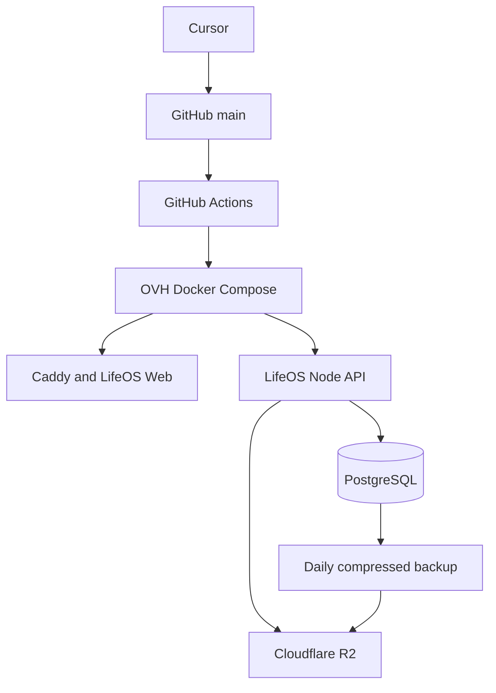

# Safe migration and cutover plan

## Target architecture

Redis is not part of the final architecture. Existing Upstash is retained temporarily as a data
bridge, not introduced as another permanent service.

## Phases

### 1. Parallel-safe repository preparation

- Build the unchanged Vite UI into a Caddy image.
- Bundle the existing TypeScript handlers into one Node API.
- Add PostgreSQL persistence, private R2 presigning and object metadata.
- Add healthchecks, backup, rollback and gated GitHub Actions deployment.
- Keep the Vercel function count unchanged so the Hobby deployment remains valid.

### 2. Account and server preparation

- Read the actual OVH VPS size, OS, IP, SSH and firewall state before modifying it.
- Install Docker Engine, Compose and Git only if missing.
- Create `/opt/lifeos/shared/.env` with mode `0600`.
- Create or select the private R2 bucket `lifeos-production`.
- Create a least-privilege R2 S3 token and configure bucket CORS for the final HTTPS origin.
- Copy existing server variables from Vercel directly into the protected OVH environment.

No credential is placed in chat, Git or the frontend.

### 3. First OVH deployment

- Leave `LIFEOS_SITE_ADDRESS=:80` for the initial IP-only smoke test.
- Keep `SYNC_UPSTASH_BRIDGE=true`.
- Run the deployment manually once, then verify Web, API, PostgreSQL and R2 health.
- Confirm container restart and VPS reboot persistence.

### 4. Data continuity test

The browser database is origin-specific, so a new hostname cannot directly read Vercel's
`localStorage`. Data is moved safely through the existing sync room:

1. Open the still-live Vercel app and let its latest local state sync.
2. Generate a six-digit pairing code there.
3. Join that code once from the OVH installation.
4. The OVH API reads the room through the Upstash bridge and persists it to PostgreSQL.

During parallel testing, OVH writes are mirrored back to Upstash. Vercel therefore remains a useful
fallback instead of becoming an immediately diverging copy.

Existing small base64 capture attachments are migrated idempotently by the OVH API when the paired
Upstash room is first read. The embedded copy is removed only after a verified R2 upload completes.
The Vercel fallback uses the existing Decision Function as an authenticated R2 gateway, so no extra
serverless function is added and private R2 references remain readable during the parallel phase.

### 5. HTTPS and full mobile acceptance

A hostname is required before the complete iPhone/PWA acceptance because iOS service workers,
microphone access and secure developer-session cookies require HTTPS. Caddy obtains and renews the
certificate automatically after the hostname resolves to the VPS.

No domain is purchased by the migration without explicit approval. A stable existing OVH hostname
can be used if it resolves correctly and is certificate-compatible; otherwise use a dedicated domain
or subdomain selected by the owner.

### 6. Production switch

Only after every item in the acceptance checklist passes:

- point the chosen production hostname to OVH;
- keep Vercel deployed and unchanged for a defined observation period;
- keep the Upstash bridge enabled during that period;
- disable the bridge only after PostgreSQL backups and restore have been verified;
- remove Vercel only through a separate explicit decision.

## Acceptance checklist

- Web, API, database and R2 health are green.
- Containers recover after restart and server reboot.
- PostgreSQL data remains after container recreation.
- A test capture uploads privately to R2 and opens through a short-lived URL.
- Daily Stats, weight, meals, routines, Morning/Evening Gate, Universal Capture, Jo, labs,
  history, plan and check-in behave as on Vercel.
- Manifest, icons, service worker, Add to Home Screen, refresh and offline shell work on iPhone.
- Voice capture and transcription work on HTTPS.
- A push to `main` builds, tests, deploys, healthchecks and updates OVH without manual SSH.
- A failed healthcheck restores the previous OVH image tag.
- A database backup exists in R2 and a controlled restore test succeeds.
